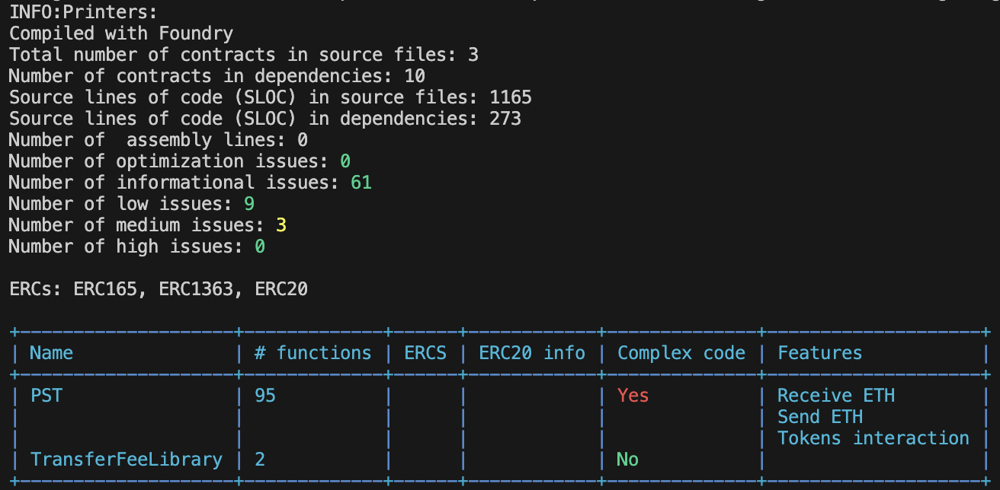

# Password Shielded Transfer(PST) 

# About

## Contract Address

- Testnet:
  - Sepolia ETH: 0x3FCACE1f442613ebdB9eCA881428884756B8C80a
  - Sepolia Zksync: 

## Description

- The main functionality of this system is the use of passwords to secure transfer operations.
- The system uses a pull-based mechanism, where the receiver has to claim a transfer.
- The receiver will need to provide a valid password to claim a transfer.

- A Password Shielded Transfer(PST) will require the following steps:

  1. [Sender] sends an [amount] of [token] to [Receiver] by submitting the following data:
      - [address] of [Receiver]
      - [token] 
      - [amount]
      - [password] chosen by the [Sender]
  2. [Sender] sends the [password] to [Receiver] by a communication method of its choice outside the platform
  3. At this point there is a pending transfer created in the system, waiting to be claimed
  4. [Receiver] can claim the pending transfer if:
      - the [password] entered matches the [password] set by [Sender] 
      - the claim is done after the cancel cooldown period has elapsed

## Properties

Additional properties:

- A PST has a few additional abilities, in regards to traditional transfers:

  1. Cancel cooldown period - sender can change its mind and cancel the transfer
  2. Transfer expiring time - if the receiver doesn't claim the transfer before expiring the sender is refunded
    
- The system charges a [fee] for every transfer. The [fee] is dynamically adjusted in relation with the amount sent  
   
- The system allows transfers of native ETH tokens as well as ERC20 tokens

- New ERC20 tokens can be approved and added by the owner

- Functions ready to be automatically called with Chainlink Automation:
    - Refunding of expired transfers(custom-logic)
    - Removing of inactive users(time-based) <- automation not active
    - Cleaning of user history(time-based) <- automation not active

# Getting Started

## Requirements

- [git](https://git-scm.com/book/en/v2/Getting-Started-Installing-Git)
  - After installing run `git --version` and the result should be `git version x.x.x`
- [foundry](https://getfoundry.sh/)
  - After installing run `forge --version` and the result should be `forge x.x.x`

## Install Dependencies

```
forge install smartcontractkit/chainlink-brownie-contracts@1.3.0 --no-commit
forge install openzeppelin/openzeppelin-contracts@v5.1.0 --no-commit
forge install foundry-rs/forge-std@v1.9.4 --no-commit 
```

## Quickstart

```
git clone https://github.com/MihaiHng/Password-Shielded-Transfer 
cd Password-Shielded-Transfer
forge build
```

## Testing 

### Static Analysis 

Slither



### Coverage Report


### Test Suite

- Unit Tests
- Integration Tests
- Fuzz Tests(stateless)
- Invariant Tests(statefull)

## Frontend 

## Future Improvements (Under Consideration)

1. Improve password encryption mechanism
2. Increase password complexity requirements to prevent brute force attacks
3. Make claims free of charge, by refunding the gas cost to the receiver, using a percentage of the transfer fees
4. Use a different solution to restrict access to important functions. Multi-sig Wallet instead of onlyOwner <- centralization risk
